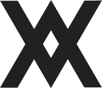

  

<h1 align="center">
  <b>Fred</b>
</h1>

  <i>Fullstack Developer · CRO Specialist · UI/UX Designer</i>

  
  
  
  

---

### 🧰 Tech Stack

  
  
  
  
  
  
  
  
  
  
  

---

### 📊 Highlights

<table>
  <tr>
    <td align="center" width="25%">
      <b>7+</b> 
      Years Experience
    </td>
    <td align="center" width="25%">
      <b>50+</b> 
      Projects Shipped
    </td>
    <td align="center" width="25%">
      <b>15+</b> 
      Happy Clients
    </td>
    <td align="center" width="25%">
      <b>99%</b> 
      Retention Rate
    </td>
  </tr>
</table>

---

### 🚀 Featured Work

| Project | Role | Stack |
|---------|------|-------|
| **[Felicia Putri Tjiasaka](https://feliciaputritjiasaka.com)** | Fullstack · UI/UX · DevOps | Laravel, jQuery |
| **FPT V2** *(Coming Soon)* | Fullstack · UI/UX · DevOps | React, Next.js, T3 |
| **[Sushi King Malaysia](https://sushi-king.com/)** | API Integration | Clevertap |
| **[Innisfree Malaysia](https://www.innisfree.my/)** | CRO · UI/UX | Google Optimize |
| **[Tokio Marine Vietnam](https://tokiomarineonline.com.vn/)** | CRM Integration | Mailchimp |
| **[UNHCR Thailand](https://www.unhcr.or.th/donate/refugees)** | CRO | Google Optimize |
| **[Cari Kuliah](https://carikuliah.com)** | Fullstack · UI/UX · DevOps | Laravel, jQuery |
| **[Peruri Sign](https://sign.peruri.co.id/)** | UI/UX Design | Adobe XD, Figma |
| **[SSCorner](https://sscorner.id)** | Frontend | Laravel |

> *Full portfolio with 15+ more projects at [dyfrediant.github.io](https://dyfrediant.github.io)*

---

### 💡 What I Do

- **Fullstack Development** — End-to-end web apps with Laravel, React, and Next.js
- **Conversion Rate Optimization (CRO)** — Data-driven A/B testing and UX improvements via Google Optimize
- **UI/UX Design** — Pixel-perfect interfaces designed in Figma & Adobe XD
- **DevOps** — Docker, CI/CD, server management, deployment pipelines
- **CRM & Marketing Automation** — Mailchimp, Clevertap integrations

---

   
  

    <i>Building digital products that convert. Pixel by pixel.</i>
  

  

